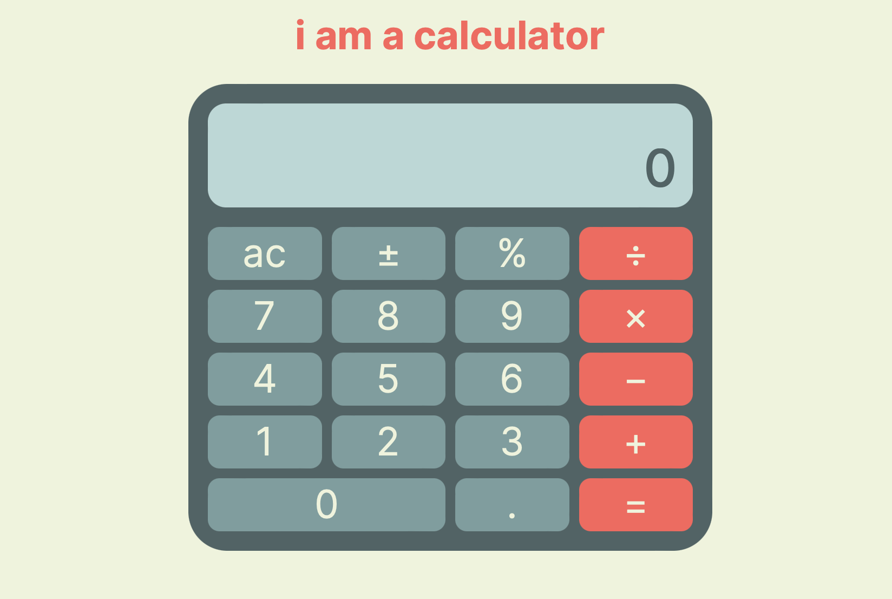
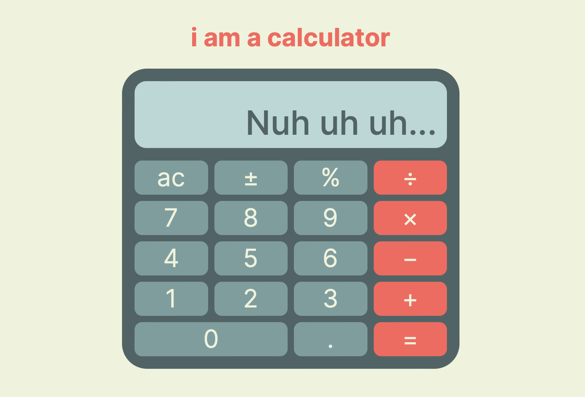

# Odin Project Calculator

## Features

- Variable rounding of decimals so that a maximum of 12 digits are displayed on the screen
- Large number outputs are transformed into scientific notation
- "All Clear" button transformed into "Clear" button, allowing users to delete the last entered number. (If last entry is not a number, button transforms back to "All Clear")
- Input control to prevent users from entering two binary operators in a row
- Visual indication of selected binary operator
- Can be operated with keypresses. (use "!" for +/-)

## Screenshots

with error message...

## Link

[Live](https://moosecowbear.github.io/odin-project-calculator/)
